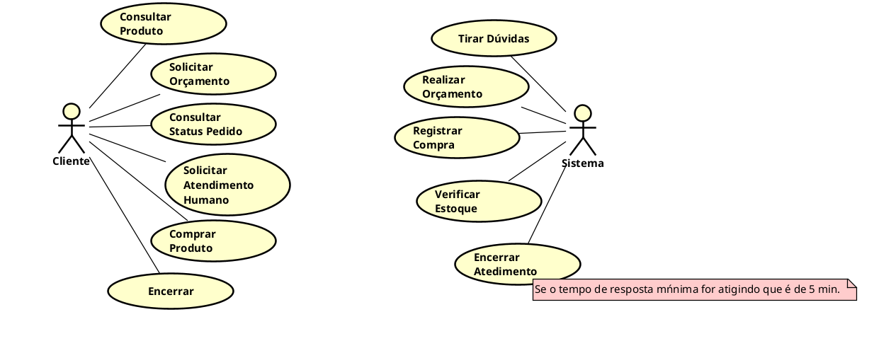

# TechBot 🤖
## 📘 Visão Geral
Um atedente para a sua assistência técnica, asssim você vai garantir que todos os seu clientes sejam atendidos de forma rápida e eficiente. Assim você nunca deixa seu cliente na mão e aumenta sua produtividade, automatizando processos e aumentando o tempo precioso para relaizar as menuntenções e os serviçoes físicos da sua assistência técnica.

## </> Tecnologias

## 🏛️ Diagramas e Arquitetura
#### Diagrama de caso de uso:

